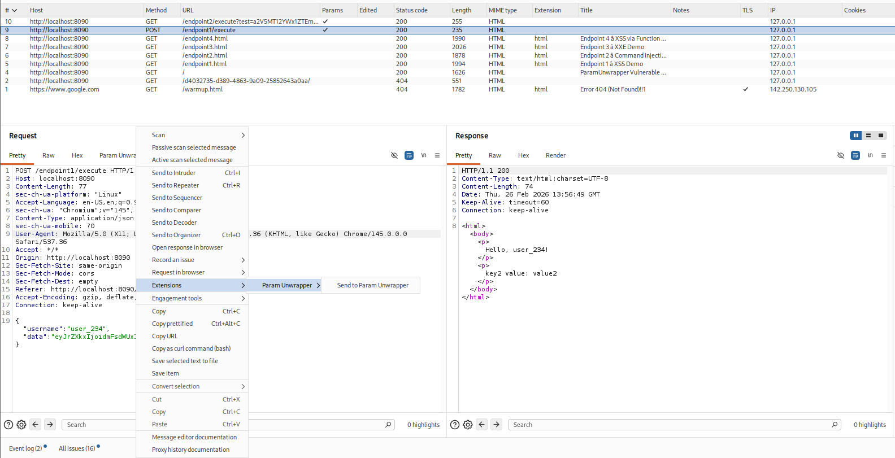
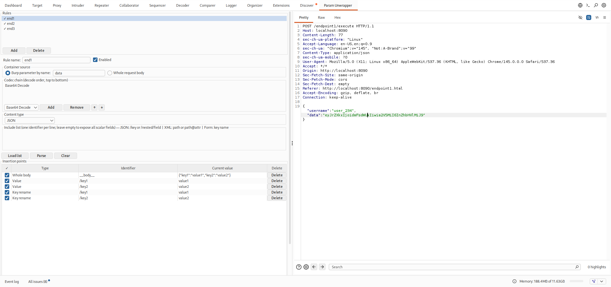
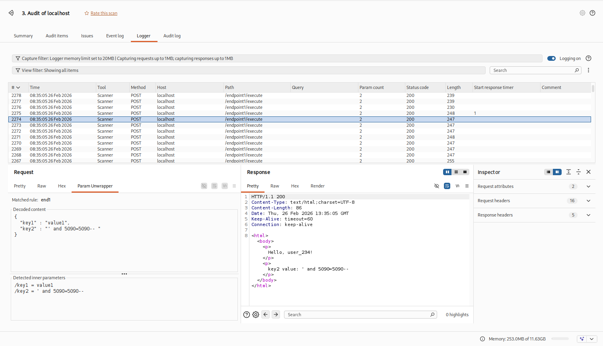
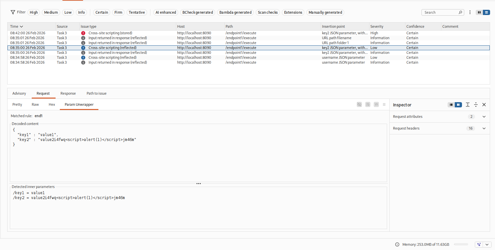
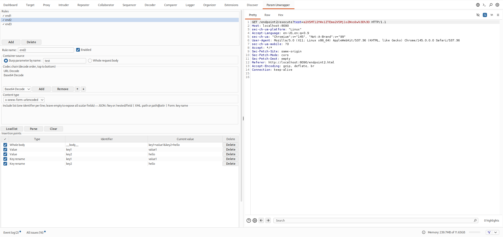
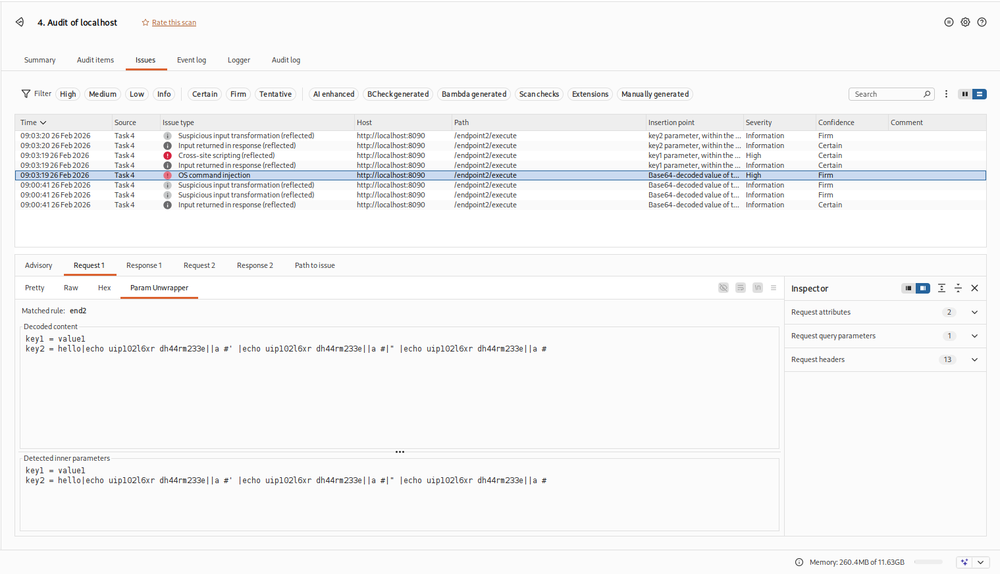
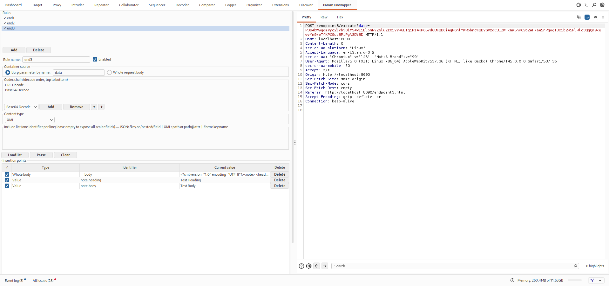
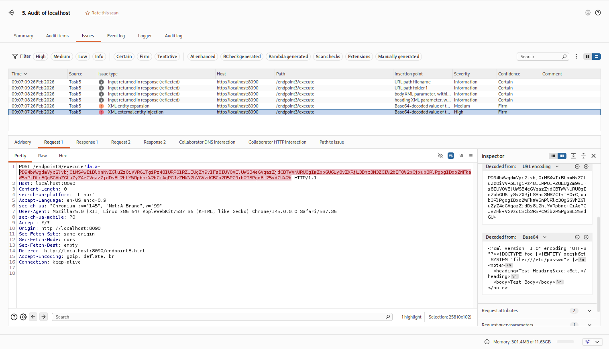
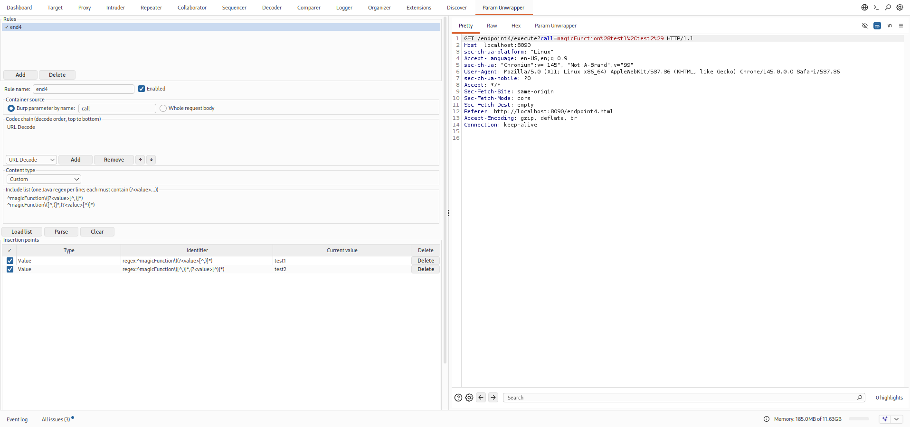
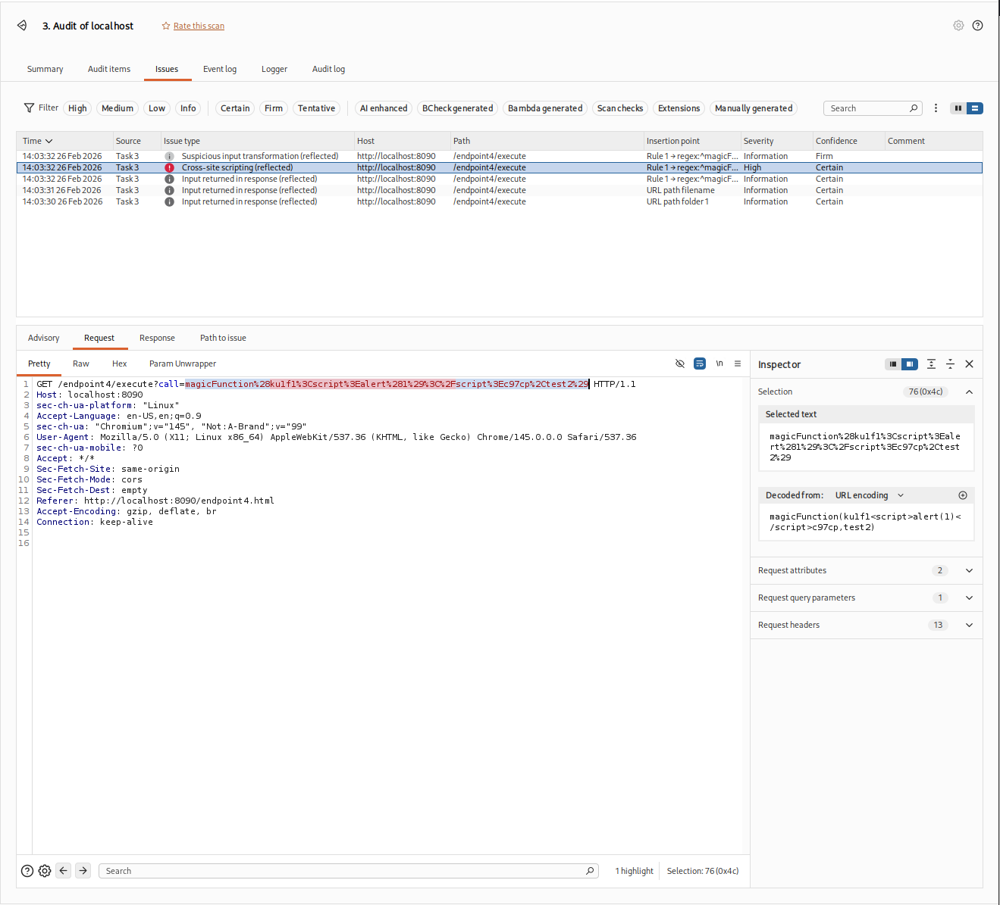

# Param Unwrapper

A Burp Suite extension (Montoya API) that enables active scanning of nested or encoded parameters by providing an interactive:

**unwrap → discover → scan**

It is designed for cases where the “real” parameters are buried inside multiple encoding layers (Base64 / URL / HTML / Unicode, etc.) and formats like JSON, XML, or `x-www-form-urlencoded`.

---


## Build

Prerequisites: Java 17+, Apache Maven 3.8+

```bash
mvn package -DskipTests
```

The fat JAR is written to:

```
target/param-unwrapper-1.0.0.jar
```

To also run the unit tests:

```bash
mvn verify
```

---

## Install into Burp Suite

1. Open Burp Suite (Pro or Community ≥ 2023.x).
2. Go to Extensions → Installed → Add.
3. Extension type: Java.
4. Select `target/param-unwrapper-1.0.0.jar`.
5. Click Next. The extension loads and adds a "Param Unwrapper" tab to the Burp Suite window.

---

## Usage workflow

### 1 — Open the tab

Click Param Unwrapper in the Burp Suite tab bar.

The tab is split horizontally:

| Left panel | Right panel |
|---|---|
| Rules list, rule editor, Parse / Clear / Delete controls, Candidates table | Large HTTP request editor |

### 2 — Load a request (Load button / context-menu integration)

Populate the right-side request editor via the context menu:

- Right-click any request in Proxy history, Repeater, Logger, etc.
- Choose "Send to Param Unwrapper" (this acts as the “load” action)

What “load” does:
- Copies the selected request into the Param Unwrapper request editor (right side)
- Leaves your rules/candidates untouched until you "Parse"

### 3 — Configure a rule

1. Click Add on the left panel to create a new rule.
2. Set a descriptive name and leave Enabled checked.

#### Container source

| Option | Description |
|--------|-------------|
| Burp parameter by name | A specific query/body/cookie parameter (e.g. `data`) |
| Whole request body | The entire raw request body |

#### Codec chain (extra codec chain support)

The codec chain is a sequence of decode steps applied top-to-bottom when parsing/unwrapping.

When the scanner injects payloads, Param Unwrapper automatically re-encodes using the reverse chain (bottom-to-top), so the outbound request preserves the original encoding layers.

Common steps:  
- Base64 Decode (decode) / Base64 encode (re-encode)  
- URL Decode (decode) / URL encode (re-encode)  
- HTML Decode  
- Unicode Escape  

You can chain them, for example:
- URL Decode → Base64 Decode  
  (useful when the Base64 text itself is URL-encoded inside a parameter)

### 4 — Parse and build a profile (Parse / Clear / Delete behavior)

#### Parse (what it does)

With a request loaded and a rule selected, click "Parse".

The extension:
1. Extracts the container (parameter value or body).
2. Decodes it via the codec chain.
3. Parses the decoded content.
4. Populates the "Insertion points" table with up to 1,024 entries.

Insertion points types:

| Insertion points type | Description |
|---|---|
| Value | A scalar leaf field; payload replaces its value |
| Key rename | An object/form key; payload becomes the new key name |
| Whole body | The entire decoded container; payload replaces it entirely |

#### Insertion points table (auto-saved)

The Insertion points table is automatically saved on every change (selection, edits, add/remove entries).  

You can:
- Use the "✓ checkbox" to include/exclude candidates
- Edit an "Identifier" cell directly (e.g. adjust a JSON Pointer, key name, etc.)
- Use "Add entry" to add candidates manually

#### Clear button

"Clear" button resets the current parse results in the UI (i.e., the Candidates/profile view) so you can start fresh.

Typical uses:
- You changed the rule configuration and want to re-parse cleanly
- You loaded a new request and don’t want to keep prior candidates visible

#### Delete button

"Delete" button removes the currently selected rule (and its associated stored candidates/profile) from the rules list.

> If you want to keep a rule but temporarily ignore it, use "Enabled" instead of deleting.

### 5 — Active scanning

When Burp Scanner actively scans a request that matches an enabled rule, Param Unwrapper:

- Builds insertion points from the current (auto-saved) "Insertion points" selection
- Applies payload mutations (VALUE / KEY / WHOLE_BODY)
- Re-encodes using the reverse codec chain
- Sends modified requests so Burp can detect issues inside previously-wrapped content

### 6 — Message editor tab (during manual viewing and during scan)

When a request is displayed in an HTTP editor (Repeater, Proxy history, etc.) a "Param Unwrapper" tab will appear automatically if a rule matches.

The tab shows:
- Which rule matched
- Pretty-printed decoded content
- All detected inner parameters and their current values
- The matched rule during automated scan and how the payload was injected (useful for validating that unwrapping worked)

---

## Custom rules (Regex-based): how regex definition works

Some wrapped formats are not pure JSON/XML/form, or you may need to extract/unwrap values from custom “function-call-like” formats.

Custom regex rules are intended for cases where:  
- The container is a string that needs parsing via patterns  
- You need to capture specific parts and treat them like candidates for injection  
- You need predictable extraction and reconstruction behavior  

### Core idea

A custom regex rule:  
1. Matches the wrapped container string  
2. Extracts one or more groups (captures) as “inner values”  
3. Treats those inner values as candidates for injection  
4. When injecting, it rebuilds the container string by replacing the appropriate capture group(s) while preserving the rest  

### Practical tips

- Prefer anchored patterns (`^...$`) to avoid unexpected partial matches.
- Use "non-greedy" quantifiers where needed (`.*?`) to avoid over-capturing.
- The named capture groups must be called "value" - `(?<value>...)`, to capture the parameters.
- Always test regex rules against realistic traffic (see examples below).

---

## Examples (trial website from ParamUnwrapperTests - https://github.com/misiungs/ParamUnwrapperTests/tree/main)

### Example 1 — XSS in nested JSON (Base64 encoded)

**Request:**
```
POST /endpoint1/execute HTTP/1.1
Host: localhost:8090
Content-Length: 77
sec-ch-ua-platform: "Linux"
Accept-Language: en-US,en;q=0.9
sec-ch-ua: "Chromium";v="145", "Not:A-Brand";v="99"
Content-Type: application/json
sec-ch-ua-mobile: ?0
User-Agent: Mozilla/5.0 (X11; Linux x86_64) AppleWebKit/537.36 (KHTML, like Gecko) Chrome/145.0.0.0 Safari/537.36
Accept: */*
Origin: http://localhost:8090
Sec-Fetch-Site: same-origin
Sec-Fetch-Mode: cors
Sec-Fetch-Dest: empty
Referer: http://localhost:8090/endpoint1.html
Accept-Encoding: gzip, deflate, br
Connection: keep-alive

{"username":"user_234","data":"eyJrZXkxIjoidmFsdWUxIiwia2V5MiI6InZhbHVlMiJ9"}
```

`data` contains a Base64-encoded JSON document (nested parameters).

**Figures:**  
- Endpoint 1 — send request to Param Unwrapper  
  
- Endpoint 1 — properly configured unwrapping rule  
  
- Endpoint 1 — Message editor tab shows matched rule during scan with injected payload  
  
- Endpoint 1 — detected by scanner: XSS inside unwrapped parameter  
  

---

### Example 2 — Command injection in nested x-www-form-urlencoded (Base64 encoded)

**Request:**
```
GET /endpoint2/execute?test=a2V5MT12YWx1ZTEma2V5Mj1oZWxsbw%3D%3D HTTP/1.1
Host: localhost:8090
sec-ch-ua-platform: "Linux"
Accept-Language: en-US,en;q=0.9
sec-ch-ua: "Chromium";v="145", "Not:A-Brand";v="99"
User-Agent: Mozilla/5.0 (X11; Linux x86_64) AppleWebKit/537.36 (KHTML, like Gecko) Chrome/145.0.0.0 Safari/537.36
sec-ch-ua-mobile: ?0
Accept: */*
Sec-Fetch-Site: same-origin
Sec-Fetch-Mode: cors
Sec-Fetch-Dest: empty
Referer: http://localhost:8090/endpoint2.html
Accept-Encoding: gzip, deflate, br
Connection: keep-alive
```

`test` contains a Base64-encoded `x-www-form-urlencoded` payload.

**Figures:**  
- Endpoint 2 — properly configured unwrapping rule  
  
- Endpoint 2 — detected by scanner: command injection and XSS inside unwrapped parameter  
  

---

### Example 3 — XXE in wrapped XML (Base64 encoded)

**Request:**
```
POST /endpoint3/execute?data=PD94bWwgdmVyc2lvbj0iMS4wIiBlbmNvZGluZz0iVVRGLTgiPz4KPG5vdGU%2BCiAgPGhlYWRpbmc%2BVGVzdCBIZWFkaW5nPC9oZWFkaW5nPgogIDxib2R5PlRlc3QgQm9keTwvYm9keT4KPC9ub3RlPg%3D%3D HTTP/1.1
Host: localhost:8090
Content-Length: 0
sec-ch-ua-platform: "Linux"
Accept-Language: en-US,en;q=0.9
sec-ch-ua: "Chromium";v="145", "Not:A-Brand";v="99"
User-Agent: Mozilla/5.0 (X11; Linux x86_64) AppleWebKit/537.36 (KHTML, like Gecko) Chrome/145.0.0.0 Safari/537.36
sec-ch-ua-mobile: ?0
Accept: */*
Origin: http://localhost:8090
Sec-Fetch-Site: same-origin
Sec-Fetch-Mode: cors
Sec-Fetch-Dest: empty
Referer: http://localhost:8090/endpoint3.html
Accept-Encoding: gzip, deflate, br
Connection: keep-alive
```

`data` contains a Base64-encoded `XML` payload.

**Figures:**  
- Endpoint 3 — properly configured unwrapping rule  
  
- Endpoint 3 — detected by scanner: XXE  
  

---

### Example 4 — Reflected XSS via URL-encoded function call body (regex parsing)

This example demonstrates a case where the wrapped value looks like a function call, and must be parsed using regex rules.

**Request:**
```
GET /endpoint4/execute?call=magicFunction%28test1%2Ctest2%29 HTTP/1.1
Host: localhost:8090
sec-ch-ua-platform: "Linux"
Accept-Language: en-US,en;q=0.9
sec-ch-ua: "Chromium";v="145", "Not:A-Brand";v="99"
User-Agent: Mozilla/5.0 (X11; Linux x86_64) AppleWebKit/537.36 (KHTML, like Gecko) Chrome/145.0.0.0 Safari/537.36
sec-ch-ua-mobile: ?0
Accept: */*
Sec-Fetch-Site: same-origin
Sec-Fetch-Mode: cors
Sec-Fetch-Dest: empty
Referer: http://localhost:8090/endpoint4.html
Accept-Encoding: gzip, deflate, br
Connection: keep-alive
```

After URL-decoding, the `call` parameter becomes:
```
magicFunction(test1,test2)
```

#### How to parse it with regexes (example approach)

Goal: treat `test1` and/or `test2` as injectable candidates while preserving:  
- the function name `magicFunction`  
- parentheses and commas  

A typical strategy is:  
- Match the full string  
- Capture each argument separately  

Example conceptual pattern:  
- test1 -> `^magicFunction\((?<value>[^,)]*)`  
- test2 -> `^magicFunction\([^,)]*,(?<value>[^)]*)`  

Then:  
- Candidate identifiers can represent "test1" and "test2"  
- Injecting into `?<value>` replaces only that capture group while keeping the rest intact
- Re-encoding URL encoding preserves the original transport encoding

**Figures:**
- Endpoint 4 — properly configured unwrapping rule  
  
- Endpoint 4 — detected by scanner  
  

---

## License

GPL-3.0 — see [LICENSE](LICENSE).